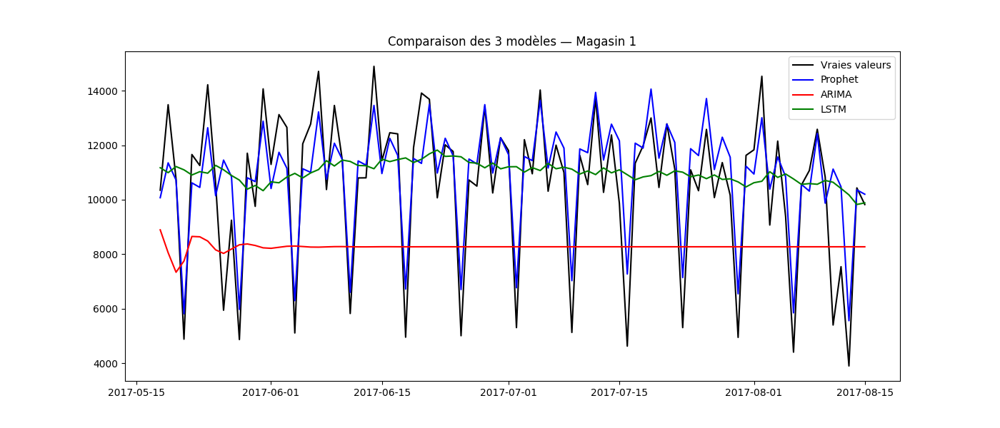
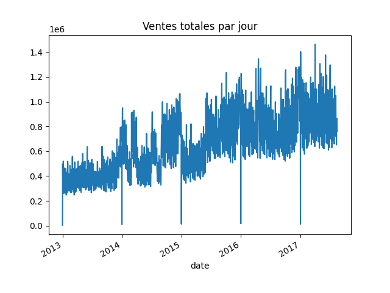
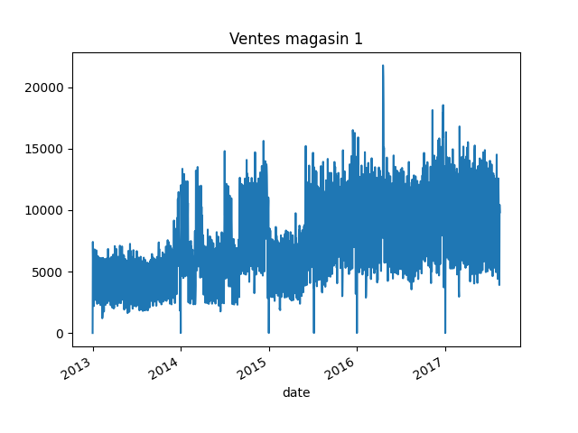

# 🛒 Store Sales - Time Series Forecasting

## 🎯 Objectif
Prévoir les ventes quotidiennes d'un magasin en utilisant des modèles Time Series.

## 📊 Dataset
- Source : Kaggle — Store Sales Time Series Forecasting
- 3 000 888 lignes — ventes de 54 magasins de 2013 à 2017
- 7 fichiers : train, test, stores, oil, holidays, transactions

## 🛠️ Modèles utilisés
| Modèle | MAE | RMSE |
|---|---|---|
| Prophet | 1044 | 1403 |
| LSTM | 2311 | 3176 |
| ARIMA | 3323 | 3572 |

## 📈 Résultats
- **Prophet** est le meilleur modèle pour ce dataset
- **ARIMA** converge vers une moyenne sur le long terme
- **LSTM** performant mais nécessite plus de données

## 🖼️ Visualisations

## 🚀 Comment reproduire
1. Cloner le repo
2. Ouvrir `notebook.ipynb` sur Kaggle
3. Lancer toutes les cellules

## 🧰 Technologies
- Python, Pandas, Matplotlib
- Prophet, Statsmodels, TensorFlow/Keras
- Scikit-learn
